# What is cosine similarity?

Cosine similarity is the number you use to say how alike two
[[embeddings]] are. It looks only at the angle between the two vectors and
ignores how long they are. It's the usual way to rank results in search
by meaning, so it's worth knowing what the score does and doesn't
tell you.

## Two arrows and the angle between them

An embedding is a list of numbers, and a list of numbers is a point in
space. Draw an arrow from the origin to that point and you have a vector
with a direction and a length.

Take four vectors with two numbers each, so you can draw them:

| Vector | Numbers | Length |
|---|---|---|
| a | (3, 4) | 5 |
| b | (6, 8) | 10 |
| c | (4, −3) | 5 |
| d | (−3, −4) | 5 |

`b` points exactly the same way as `a`, it's just twice as long. `c` is
turned a quarter circle away. `d` points the opposite way.

Cosine similarity asks one question: how far apart are the directions?
Same direction scores 1. At right angles scores 0. Opposite scores −1.
So `a` and `b` get 1, even though one is twice the length of the other.
`a` and `c` get 0, and `a` and `d` get −1.

## The formula: dot product, divided by the lengths

You don't measure the angle with a protractor. You get it from the
numbers.

First, the **dot product**: multiply the two lists position by position
and add up the results. For `a` and `c`: 3×4 + 4×(−3) = 12 − 12 = 0.

The dot product gets bigger as the arrows line up, but it also gets
bigger as they get longer. For `a` and `b` it's 3×6 + 4×8 = 50,
while `a` with itself is only 25. To cancel out length, divide by both
lengths:

$$
\cos(a, b) = \frac{a \cdot b}{\lVert a \rVert \, \lVert b \rVert}
$$

For `a` and `b`: 50 ÷ (5 × 10) = 1. For a vector a little off from `a`,
say (4, 3): 3×4 + 4×3 = 24, divided by 5 × 5, gives 0.96. Close to 1,
because the arrows nearly line up.

A real embedding has hundreds or thousands of numbers instead of two, but
the arithmetic is the same: one multiply and one add per position, then
one division.

## When vectors have length 1, it's just a dot product

Dividing a vector by its own length gives a vector of length 1 pointing
the same way. This is called **normalizing**. If both vectors are already
length 1, the division in the formula is by 1 × 1, and cosine similarity
is exactly the dot product.

Some embedding APIs hand you vectors that are already normalized.
OpenAI's come normalized to length 1, which has two practical effects:

- You can skip the division and use the dot product, which is slightly
  faster.
- Cosine similarity and plain distance between the points
  (Euclidean distance) put results in the same order. For search, the
  choice between them stops mattering.

## Where it gets tricky

**A score isn't a percentage.** 0.6 doesn't mean "60% similar". It's the
cosine of an angle, anywhere from −1 to 1, and what counts as a high score
depends on the model. You'll see real scores from one small model in
[[semantic-search]].

**Throwing away length can throw away information.** Cosine keeps only
the direction. For some learned embeddings, researchers at Netflix showed
mathematically that cosine scores can come out arbitrary: they depend on
how the model was regularized during training, and for some models they
aren't even unique. Their work was on recommendation-style models, not on
text embedding APIs, and a plain dot product sometimes works better and
sometimes worse in practice. The takeaway is to treat the score as a
ranking signal the model's training shaped, not as a ground truth about
meaning.

**It only compares vectors from the same model.** Two embedding models
put text in different spaces. A cosine between a vector from one and a
vector from the other means nothing.

## What this means when you build

- Check whether your embedding model returns normalized vectors. If it
  does, use the dot product: same ranking, less work.
- If you shorten vectors yourself (keep the first N numbers), normalize
  them again before comparing. APIs that shorten for you handle this.
- Don't hard-code a similarity threshold copied from somewhere else. Look
  at scores on your own data with your own model first.
- Cosine similarity is the scoring step inside [[semantic-search]]: embed
  the question, score it against every stored chunk, keep the top few.

## Further reading

- [Vector embeddings](https://developers.openai.com/api/docs/guides/embeddings),
  OpenAI docs. The practical rule: use cosine, vectors come normalized, and
  dot product and Euclidean distance then give the same ranking.
- [Is Cosine-Similarity of Embeddings Really About Similarity?](https://arxiv.org/abs/2403.05440),
  Steck, Ekanadham and Kallus (Netflix), 2024. The counterpoint: when a
  cosine score can be arbitrary, and why not to trust it blindly.
